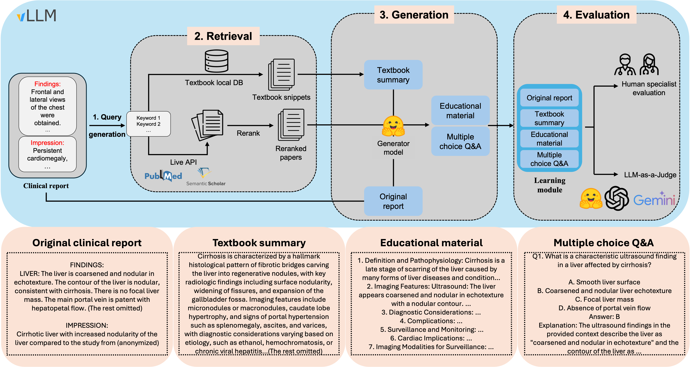
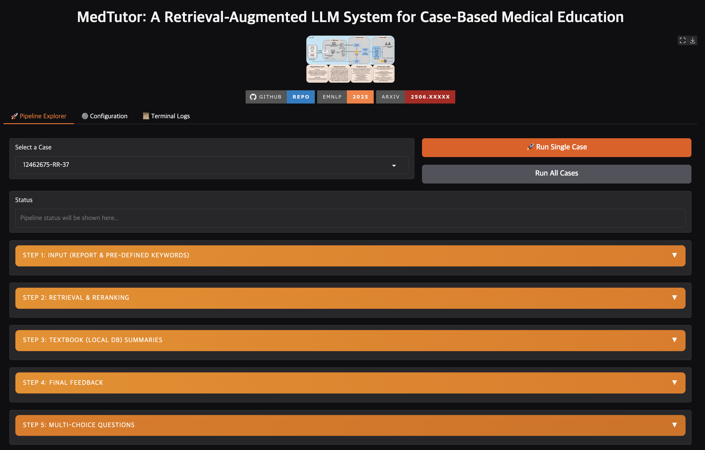

# MedTutor: A Retrieval-Augmented LLM System for Case-Based Medical Education

<p align="center">
  <a href="https://opendatacommons.org/licenses/by/1-0/"></a>
  <a href="https://2025.emnlp.org/calls/demos/"></a>
  <a href="https://placeholder.com/"></a>
  <a href="https://huggingface.co/datasets/yale-nlp/MedTutor"></a>
  <a href="https://www.youtube.com/watch?v=7NlCjVf8V4E"></a>
</p>

## Overview

<p align="center">
  
  <br>
  <em>Figure 1. Overview of the MedTutor pipeline.</em>
</p>

**MedTutor** is a high-performance, asynchronous pipeline designed for advanced Retrieval-Augmented Generation (RAG) in the medical domain. This project leverages the power of local, self-hosted LLMs and the `vLLM` inference engine to deliver state-of-the-art throughput for complex analysis of medical reports, such as radiology reviews.

The primary goal of this repository is to provide a robust and scalable framework for researchers and clinicians to synthesize evidence from multiple sources—including internal knowledge bases and external academic literature—to generate educational feedback and assessments. The pipeline is architected for efficiency, utilizing multi-GPU parallel processing and continuous batching to handle large-scale datasets.

<p align="center">
<a href="https://www.youtube.com/watch?v=7NlCjVf8V4E" target="_blank">

</a>
<br>
<em>Figure 2. Click to watch the MedTutor Demo Video.</em>
</p>

## Key Features

- **High-Throughput Inference**
  - Built on `vLLM` for fast, continuous batching and optimized GPU utilization.
- **Hybrid Retrieval**
  - Combines dense vector-based retrieval from a local knowledge base (e.g., textbook pages) with live API searches on academic databases like PubMed and Semantic Scholar.
- **Advanced Reranking**
  - Employs state-of-the-art reranker models (e.g., `Qwen/Qwen3-Reranker-8B`) to intelligently score and prioritize retrieved documents based on clinical context.
- **Multi-Stage Batch Generation**
  - A modular, multi-stage pipeline that first synthesizes evidence into summaries and then generates comprehensive final reports and Multiple-Choice Questions (MCQs) in large, efficient batches.
- **Asynchronous Architecture**
  - Utilizes `asyncio` and `multiprocessing` to handle I/O-bound tasks (like API calls) and compute-bound tasks (like LLM inference) concurrently, maximizing efficiency.
- **Interactive UI**
  - Includes a Gradio-based interface (`app.py`) for interactively running and exploring the pipeline's output for a single case.

## 📂 Publicly Available Dataset

To facilitate further research, we are publicly releasing a large-scale dataset(total size of 144K) generated by the MedTutor pipeline. This dataset includes outputs from multiple generator models and evaluations from both LLM-as-a-Judge and expert human annotators.

| Hugging Face Dataset |
| :--- |
| [](https://huggingface.co/datasets/yale-nlp/MedTutor) |


## Pipeline Architecture

The pipeline executes in a series of distinct, sequential stages. Each stage is completed for all cases in the dataset before moving to the next, leveraging batch processing for maximum efficiency at the generation steps.

1.  **Data Loading & Pre-computation:**
    *   Loads the input dataset of cases (e.g., radiology reports with associated keywords).
    *   Loads a pre-computed local vector index (e.g., embedded textbook pages).
    *   Computes embeddings for all unique keywords from the input cases.

2.  **Stage 1: Hybrid Retrieval & Reranking:**
    *   For each keyword in a case, the pipeline performs retrieval from multiple sources:
        *   **Local Retrieval:** A fast vector search against the local knowledge base.
        *   **Live Retrieval:** Asynchronous API calls to PubMed and Semantic Scholar.
    *   The retrieved documents are then reranked using a powerful model to select the most relevant evidence for the given clinical context.

3.  **Stage 2: Textbook Summary Generation:**
    *   The system collects all locally retrieved textbook pages for all cases.
    *   It sends a single, large **batch request** to the LLM service to generate a concise summary for each set of pages, focusing on its associated keyword.

4.  **Stage 3: Final Report & MCQ Generation:**
    *   The system synthesizes all evidence for each case: reranked papers and generated textbook summaries.
    *   It sends two final **batch requests** to the LLM service:
        *   One to generate a comprehensive, educational feedback report for each case.
        *   One to generate a set of Multiple-Choice Questions (MCQs) for assessment based on the synthesized evidence.


## Project Structure
```
medical-rag/
├── pipeline/
│ ├── configs/ # Experiment configuration files
│ ├── data/
│ │ └── input_files/ # Input data (e.g., keyword files)
│ │ 
│ ├── result/ # Output directory for pipeline runs
│ ├── utils/
│ │ ├── embed.py # Script to create vector index
│ │ ├── keywords_generator.py # Script to create keywords
│ │ ├── retrieval.py # Core retrieval & reranking logic
│ │ └── vllm_handler.py # vLLM inference logic
│ ├── llm_annotation/ # LLM-as-a-Judge evaluation tools
│ │ ├── run_annotation.py
│ │ └── README.md
│ ├── manual_annotation/ # Manual annotation UI
│ │ ├── annotation_tool.py
│ │ └── README.md
│ ├── async_main.py # Main pipeline execution script
│ ├── app.py # Gradio interactive demo UI
│ ├── llm_services.py # Client for vLLM workers
│ ├── requirements.txt
│ └── run_exp.sh # Example script for running experiments
└── README.md           
```

## Setup and Installation

### Prerequisites

-   Python 3.11+
-   NVIDIA GPU with CUDA 11.8 or higher

### Installation Steps

1.  **Clone the repository:**
    ```bash
    git clone https://github.com/yale-nlp/medical-rag.git
    cd medical-rag
    ```

2.  **Create a virtual environment (recommended):**
    ```bash
    conda create -n medtutor python=3.11 -y
    conda activate medtutor
    ```

3.  **Install `vLLM`:**
    This project relies on `vllm`, which has specific installation requirements. Please follow the [official vLLM installation guide](https://docs.vllm.ai/en/stable/getting_started/installation/index.html).

4.  **Install remaining packages:**
    ```bash
    pip install -r requirements.txt
    ```

5.  **Set up environment variables:**
    Create a `.env` file. This file is used to store API keys for live retrieval. Then edit `.env` and add your API keys:
    ```
    SEMANTIC_SCHOLAR_API_KEY="YOUR_S2_API_KEY"
    PUBMED_API_KEY="YOUR_PUBMED_API_KEY"
    GEMINI_API_KEY="YOUR_GEMINI_API_KEY"
    OPENAI_API_KEY="YOUR_OPENAI_API_KEY"
    ```

## Data Pre-computation

Before running the main pipeline, you need two key input files: a **keyword file** and a **local vector index**.

### 1. Keyword File Generation
This pipeline requires an input file where each case has a list of keywords. The script `utils/keywords_generator.py` can generate these keywords from raw reports using a local model served via vLLM.
This script operates in a server-client architecture for high-throughput processing of large datasets.

1.  **Prepare your input file:** Your source data must be a JSONL file, where each line is a JSON object containing at least a "report" field.
    * Example input file: `data/keywords_sample/keyword_generator_input_sample.jsonl`

2.  **Customize your prompt (Optional):**
The system prompt used to guide the model is located in pipeline/prompts.json. You can edit the keyword_generator prompt to better suit your needs.
    * Example prompt file: `configs/keywords_generator_prompt.json`

3.  **Run the keyword generation script:**
Navigate to the root directory of the project. The script will start a vLLM server in the background, process all reports, and then automatically shut down the server.
Execute the script from the root directory using the following command structure, providing paths for the input, output, and prompt files.

```bash
python utils/keywords_generator.py --input data/keywords_sample/keyword_generator_input_sample.jsonl --output data/keyword_generator_input_sample/keyword_generator_output_sample.jsonl --prompts configs/keywords_generator_prompt.json
```

4.  **Check the output:** The script will create a new JSONL file at your specified output path. Each line will contain the original report data plus two new fields: "_raw_response" and "keywords". You can then use this file for the next steps in the pipeline.

### 2. Local Vector Index Generation
The local retrieval component relies on a pre-computed vector index of your knowledge base (e.g., textbook pages).

1.  **Place your source text files** into a directory like `pipeline/data/`.
2.  **Run the embedding script** from the `pipeline/` directory(**Must** update the `embed.py` manually to align with your source text files). This script will load the text, embed it using the specified HuggingFace model, and save the index.
    ```bash
    # from inside the pipeline/ directory
    python utils/embed.py
    ```
3.  This will create a file like `data/embedded_pages_hf_...json`. Update the `local_index_path` in your configuration file to point to this new file.

4. An example file with pre-generated embeddings is available [here](https://huggingface.co/datasets/jj97/medtutor_embed_page_example).


## Configuration

The pipeline is controlled by a central JSON configuration file (e.g., `configs/configs_all.json`).

-   `hf_embedding_model` / `embedding_model_device`: Specifies the model for embedding queries.
-   `retrievers`: An array to enable/disable retrieval sources (`"local"`, `"pubmed"`, `"semantic"`).
-   `keyword_file`, `local_index_path`: Paths to your pre-computed data.
-   `feedback_dir`: Directory where the final output JSON will be saved.
-   **`services`**: Defines the models to be loaded onto GPUs. You can define multiple services (e.g., one for reranking, one for generation) and assign them to specific GPUs (`gpu_id`) and set `tensor_parallel_size`.
-   **`service_map`**: Maps pipeline stages (`reranker`, `textbook_summary`, etc.) to the services defined above. This allows you to use different models for different tasks.
-   `system`: Contains the system personas and user instruction templates for all generation tasks, enabling easy prompt engineering.


## Usage

The pipeline is executed from the command line via `async_main.py`.

### Basic Execution

To run the pipeline with the default configuration file (`configs_all.json`):
```bash
python async_main.py
```

### Specifying a Configuration File
For running different experiments, you can use the --config argument to point to a different file. This is the recommended way to manage multiple experimental setups.

```bash
python async_main.py --config configs/configs.json
```

> ⚠️ **Important:** Before running, you must edit the `configs.json` file. Make sure to replace the placeholder paths with the actual paths to your local files, such as your embedding index, keyword files, and output directories. The script will fail if these paths are not correctly configured.

### Enabling Debug Mode
To see detailed logs, including individual prompt contents and intermediate steps, use the --debug flag.

```bash
python async_main.py --config configs/my_experiment.json --debug
```

### Running the Interactive System UI
To explore the pipeline's functionality on a single case, run the Gradio application:

<p align="center">
  
  <br>
  <em>Figure 3. Overview of the MedTutor System UI.</em>
</p>

```bash
python app.py
```

For a quick start without running the live pipeline, you can use the demo mode, which uses pre-generated results:

```bash
python app.py --demo_mode
```

### Evaluation Tools
This repository includes powerful tools for evaluating the pipeline's output.

LLM-as-a-Judge Annotation: An automated system for evaluating generated content using another LLM (e.g. MedGemma, Gemini and etc.) as a "judge." This is ideal for large-scale, reproducible evaluation.

See instructions: [LLM Annotation Instructions](/pipeline/llm_annotation/README.md)

Manual Annotation Tool: A Streamlit-based user interface designed for human experts to perform detailed, side-by-side comparative annotation of outputs from different models.

See instructions: [Manual Annotation Instructions](/pipeline/manual_annotation/README.md)

### Output Format
The pipeline generates a single JSON file in the directory specified by feedback_dir. The output file contains a timestamp, the configuration used for the run, and a list of processed reports. Each report object is structured as follows:

```json
{
  "case_id": "...",
  "original_keywords": ["keyword1", "keyword2"],
  "original_reviewer_report": "The original text of the report...",
  "evidence_reranked_papers": {
    "keyword1": [
      { 
      "title": "...", 
      "abstract": "...", 
      "rerank_score": 0.3184, 
      ... 
      },
      ...
    ]
  },
  "evidence_retrieved_textbook_pages": {
    "keyword1": [
      { 
      "index": 101, 
      "text": "Text from the textbook page..." 
      },
      ...
    ]
  },
  "generated_textbook_summaries": {
    "keyword1": "A concise summary generated by the LLM..."
  },
  "generated_final_feedback": "The final, synthesized educational feedback report...",
  "generated_mcqs": "Q1. ...\nA. ...\nAnswer: A\n..."
}
```

### Citation
If you use our work or the MedTutor dataset in your research, please cite our paper as follows:

```bibtex
@inproceedings{jang2025medtutor,
  title={{M}ed{T}utor: A Retrieval-Augmented {LLM} System for Case-Based Medical Education},
  author={Jang, Dongsuk and Shangguan, Ziyao and Tegtmeyer, Kyle and Gupta, Anurag and Czerminski, Jan and Chheang, Sophie  and Cohan, Arman},
  booktitle={Proceedings of the 2025 Conference on Empirical Methods in Natural Language Processing: System Demonstrations},
  year={2025},
  publisher={Association for Computational Linguistics},
  url={https://placeholder_link_to_proceedings},
  note={To appear}
}
