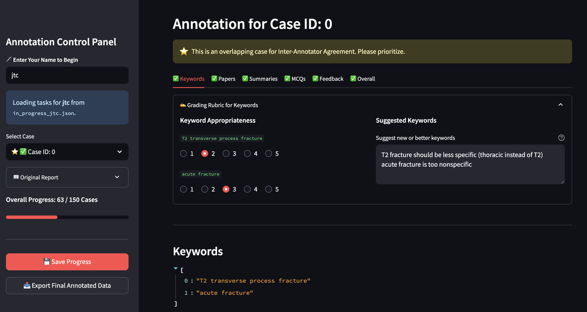

# Human Annotation Tool

This directory contains a Streamlit-based user interface for manual, expert-driven annotation of the MedTutor pipeline's outputs. The tool is designed for side-by-side comparative evaluation of results from different models or experiments.

## Overview

<p align="center">
  
  <br>
  <em>Figure 4. Overview of the Human Annotation System UI.</em>
</p>

The annotation tool provides a structured and user-friendly web interface where an expert (e.g., a board-certified radiologist) can review the generated content for a clinical case from two different models simultaneously. It allows for rating various aspects of the output, from keyword relevance to the quality of the final feedback and MCQs.

## Key Features

-   **Comparative View:** Displays outputs from two experiments side-by-side for direct comparison.
-   **Comprehensive Criteria:** Allows annotation across multiple dimensions: keyword appropriateness, paper relevance, summary quality, MCQ quality, and overall feedback.
-   **Progress Tracking:** The sidebar visually indicates which cases have been fully annotated, skipped, or are still pending.
-   **Session Management:** Automatically saves an annotator's progress, allowing them to stop and resume their work at any time. Each annotator's progress is saved to a separate file.
-   **Data Export:** Generates a clean, final JSON file containing all annotations, ready for analysis.

## Setup

1.  **Install Dependencies:** Ensure you have Streamlit and other required packages installed.
    ```bash
    pip install streamlit
    ```

2.  **Place Result Files:** The tool reads pipeline output files directly. Ensure the JSON files you want to compare are accessible and their paths are correctly configured in the script.

## Configuration

Configuration is done directly within the `manual_annotation/annotation_tool.py` script.

1.  **Define Experiments:** Locate the `EXPERIMENTS` dictionary at the top of the script. Modify it to point to the two JSON output files you wish to compare.
    ```python
    EXPERIMENTS = {
        "exp1": {
            "name": "MEDGEMMA", # Display name for Model A
            "input_file": BASE_RESULT_DIR / "path/to/model_a_results.json",
        },
        "exp2": {
            "name": "LLAMA", # Display name for Model B
            "input_file": BASE_RESULT_DIR / "path/to/model_b_results.json",
        }
    }
    ```

2.  **File Paths:** The `BASE_RESULT_DIR` constant can be adjusted if your result files are located elsewhere. Progress and backup files are saved to `result/annotation_in_progress` and `result/annotated_backups` respectively.

## Usage

1.  **Run the Streamlit App:** Navigate to the project's root directory and run the following command in your terminal:
    ```bash
    streamlit run manual_annotation/annotation_tool.py
    ```

2.  **Annotation Workflow:**
    *   A web browser window will open with the application.
    *   **Enter Your Name:** Start by entering your name in the sidebar. This creates your unique session file.
    *   **Select a Case:** Use the dropdown in the sidebar to navigate between cases.
    *   **Annotate:** Use the tabs (`Keywords`, `Papers`, `Summaries`, etc.) to view the content and provide ratings using the radio buttons and text fields.
    *   **Save Progress:** Click the "Save Progress" button in the sidebar periodically. Your work is also saved when you export or move to the next case.
    *   **Export Data:** Once you have finished, click "Export Final Annotated Data" to generate the final, clean dataset.

## Output Format

The "Export" function creates a new JSON file for each experiment, containing only the annotated cases. An `annotation` block is added to each case, structured as follows:

```json
[
  {
    "case_id": "...",
    "original_reviewer_report": "...",
    "generated_final_feedback": "...",
    ...,
    "annotation": {
      "annotator": "Your Name",
      "annotation_timestamp": "2026-01-01T12:00:00.000Z",
      "keyword_appropriateness": { "keyword1": 5, ... },
      "suggested_keywords": "A better keyword",
      "paper_relevance": { "http://...": 4 },
      "summary_quality": 5,
      "final_feedback_quality": 4,
      "mcq_quality": [5, 4, 5, 3],
      "overall_correctness": 1,
      "overall_comments": "This model performed well."
    }
  }
]